# Autonomous SWE Agent

An AI system that autonomously reads GitHub issues, writes code to fix them, tests the code, and opens Pull Requests. Built over 8 weeks as an advanced AI engineering project.

## Project Overview

The goal is to build a production-grade autonomous AI software engineer that:

1. Watches a GitHub repo for new issues via webhook
2. Spins up an isolated Docker sandbox 
3. Uses an LLM to understand the codebase, plan a fix, write code, run tests, and debug failures
4. Opens a Pull Request with the fix and explanation
5. Does all of this without any human involvement from issue creation to PR opening

This project covers the full stack of an agentic AI system:

- GitHub integration (webhooks, issues, PRs)
- Codebase understanding (tree-sitter parsing, sentence-transformers embedding, ChromaDB vector store)
- ReAct reasoning loop (multi-step Reason → Act → Observe)
- Sandboxed code execution (Docker SDK, network isolation, filesystem constraints, timeouts)
- Backend orchestration (FastAPI, Celery, Redis, PostgreSQL)
- Full observability (Prometheus metrics, Grafana dashboards, OpenTelemetry tracing)
- Production deployment (Kubernetes, Helm, CI/CD with GitHub Actions)

## System Architecture

The system has six layers, each independently testable and deployable:

1. **GitHub Integration** - webhooks, issue parsing, repo cloning, PR creation
2. **Codebase Understanding** - AST parsing, embedding, vector search, call graph analysis 
3. **Planning & Reasoning** - Multi-agent design (Planner → Coder ReAct loop → Reviewer) with shared token & monetary budget
4. **Sandboxed Execution** - isolated Docker containers, network/filesystem constraints 
5. **Backend & Queue** - FastAPI orchestrator, Celery workers, Redis broker, PostgreSQL store
6. **Observability & DevOps** - metrics, traces, logs, dashboards, Kubernetes, CI/CD

### End-to-End Webhook-to-PR Workflow

```mermaid
sequenceDiagram
    autonumber
    actor GitHub as "GitHub Webhook"
    participant Gateway as "FastAPI Gateway (app/main.py)"
    participant Broker as "Redis / Celery (workers/tasks.py)"
    participant DB as "PostgreSQL (db/models.py)"
    participant LocalGit as "Git & Indexer (agent/github.py & retrieval.py)"
    participant Planner as "Planner Agent (agent/planner.py)"
    participant Sandbox as "Docker Sandbox (agent/sandbox.py)"
    participant Coder as "Coder Agent ReAct (agent/loop.py)"
    participant Reviewer as "Reviewer Agent (agent/reviewer.py)"
    participant GHRest as "GitHub REST API"

    GitHub->>Gateway: POST /webhooks/github (HMAC Signature)
    Gateway->>Gateway: _verify_signature() & parse_webhook_event()
    Gateway->>DB: Check WebhookEvent (deduplication)
    Gateway->>Gateway: Mint run_id (UUID)
    Gateway->>Broker: run_issue.delay(repo, issue_number, use_sandbox, run_id)
    Gateway-->>GitHub: 202 Accepted (run_id)

    Broker->>DB: Persist Run record (status="running")
    Broker->>GHRest: client.get_issue(repo, issue_number)
    GHRest-->>Broker: Issue metadata

    Broker->>LocalGit: clone() & create_branch("agent/issue-N")
    Broker->>LocalGit: index_repo() (Tree-Sitter + ChromaDB Ephemeral)

    Broker->>Planner: run_planner(issue_task, workspace)
    LocalGit-->>Planner: Codebase retrieval (top-k chunks)
    Planner-->>Broker: PlannerOutput (understanding, steps, hypothesis, test_strategy)
    Broker->>DB: Persist Planner Step
    Broker->>GHRest: client.comment_on_issue() [Pre-work comment]

    opt If use_sandbox == True
        Broker->>Sandbox: Sandbox(workspace).start()
        Sandbox->>Sandbox: Spin up Docker container (--network none, --read-only, --user non-root)
    end

    Broker->>Coder: ReActAgent.run_with_plan(task, plan, sandbox)
    loop ReAct Tool Execution Loop
        Coder->>LocalGit: view_file / replace_file_content / search
        alt Tool == run_tests (Sandboxed execution)
            Coder->>Sandbox: sandbox.run_tests(target)
            Sandbox->>Sandbox: docker exec aswe-sbx-XXX pytest
            Sandbox-->>Coder: ExecResult (exit code + stdout/stderr)
        else Host file inspection/edit
            LocalGit-->>Coder: File content / edit status
        end
        Coder->>DB: Persist Coder Step (incremental)
    end
    Coder-->>Broker: RunResult (completed, final_text)

    Broker->>LocalGit: _capture_diff() (git add -A && git diff --cached)
    Broker->>Reviewer: run_reviewer(task, plan, diff, test_output)
    Reviewer-->>Broker: ReviewerOutput (verdict: approve/request_changes)
    Broker->>DB: Persist Reviewer Step

    alt Verdict == request_changes (up to MAX_REVIEW_ROUNDS)
        Broker->>Coder: agent.run(feedback_task with prior diff & feedback)
        Coder->>Sandbox: Re-run sandboxed tests as needed
    end

    Broker->>LocalGit: submit_changes() (commit_all & push)
    Broker->>GHRest: client.create_pull_request()
    GHRest-->>Broker: PullRequest (pr_url, pr_number)

    Broker->>GHRest: client.comment_on_issue() [Final PR comment]
    opt If use_sandbox == True
        Broker->>Sandbox: sandbox.close() (docker rm -f container)
    end
    Broker->>LocalGit: drop_repo() & Cleanup workspace
    Broker->>DB: Final update (status="completed", pr_url, cost, finished_at)
```




## Key Features

- **ReAct reasoning loop:** Full multi-step Reason → Act → Observe → Reason cycle (5-20 steps per issue)
- **Codebase-aware retrieval:** Parses ASTs, builds call graphs, uses hybrid semantic + structural search 
- **Sandboxed execution:** Fresh isolated Docker container per run, no network access, read-only host FS
- **Cost management:** Hard cap on LLM calls, sandbox CPU/time budget, token usage tracking
- **GitHub integration:** Live webhook-to-PR pipeline, no simulated APIs
- **Production observability:** Distributed tracing, Prometheus metrics, Grafana dashboards, Kubernetes

## Status

By component:

- **Environment setup:** Done ✅
- **Codebase understanding** (`agent/retrieval.py`): Done ✅ — tree-sitter chunking, embeddings, ChromaDB, call graph, token-budgeted context
- **ReAct reasoning loop** (`agent/loop.py` + `agent/providers/`): Done ✅ — multi-step loop, budget controller, sandboxed tools, pluggable Anthropic/Gemini (`gemini-3.5-flash`) providers
- **GitHub integration** (`agent/github.py`): Done ✅ — REST client with rate-limiting backoff, HMAC signature verification, idempotent PR creation, webhook event ingestion
- **Docker sandbox** (`agent/sandbox.py`): Done ✅ — hardened per-run container (`--network none`, read-only host FS, resource caps, pytest integration)
- **Backend & queue** (`app/`, `workers/`, `db/`): Done ✅ — FastAPI web gateway, Celery distributed task queue, Redis broker, PostgreSQL database state tracking with Alembic migrations
- **Docker Compose & Webhook Tunneling:** Done ✅ — full multi-container local production environment exposed via ngrok for automated end-to-end GitHub issue processing
- **Observability & cloud deployment** (`monitoring/`, `k8s/`, `helm/`): In progress ⏳ (Phase 1-2 cloud deployment roadmap established)

## Quick Start (Docker Compose & Webhooks)

```bash
# 1. Clone & create environment file
cp .env.example .env
# Edit .env and set GITHUB_TOKEN, GITHUB_WEBHOOK_SECRET, and GEMINI_API_KEY / ANTHROPIC_API_KEY

# 2. Start the multi-container stack (API, Worker, Redis, Postgres, DB Migrations)
docker-compose up --build

# 3. Expose local API gateway to GitHub via ngrok
ngrok http 8000

# 4. Add Webhook to your GitHub Repo
# Payload URL: https://<your-ngrok-domain>.ngrok-free.dev/webhooks/github
# Content type: application/json
# Secret: <your GITHUB_WEBHOOK_SECRET>
# Events: Issues

# 5. Open an issue on GitHub — the agent will autonomously solve it and submit a PR!
```

### Manual CLI Usage

```bash
# 1. Install dependencies (into your virtual environment)
pip install -r requirements.txt

# 2. Run the agent directly on a task against a local repo
python -m agent.loop "Fix the off-by-one in paginate()" --workspace /path/to/repo --auto-index
```

The model and effort are configurable via env vars (`LLM_PROVIDER`, `LLM_MODEL`,
`LLM_EFFORT`); budgets via CLI flags (`--max-steps`, `--max-usd`).

## Development

The `docs/` folder has deep-dives on each component built so far:

- [docs/retrieval.md](docs/retrieval.md) — the codebase understanding engine
- [docs/loop.md](docs/loop.md) — the ReAct agent loop and tools
- [docs/github.md](docs/github.md) — GitHub integration: issue intake, PR output, git helpers
- [docs/sandbox.md](docs/sandbox.md) — the hardened Docker execution sandbox
- [docs/llm-provider-abstraction.md](docs/llm-provider-abstraction.md) — ADR: pluggable Anthropic/Gemini providers

Core tech stack:

- Python 3.12
- LLM: pluggable — Anthropic Claude **or** Google Gemini (see [docs/llm-provider-abstraction.md](docs/llm-provider-abstraction.md))
- Docker + Kubernetes 
- FastAPI + Celery
- Prometheus + Grafana
- GitHub Actions CI/CD

The reasoning core is not hard-wired to one vendor. The ReAct loop talks to an
`LLMProvider` interface, and a thin adapter selects Anthropic or Gemini at
runtime via the `LLM_PROVIDER` env var (default `anthropic`, model
`claude-opus-4-8`). See the ADR linked above for the contract and rationale.

## About the Author

This project was built by Nadeem, a third-year B.Tech student at IIT Bombay interning at Alimento Agro Foods. Nadeem is preparing for ML/AI engineering roles post-graduation.