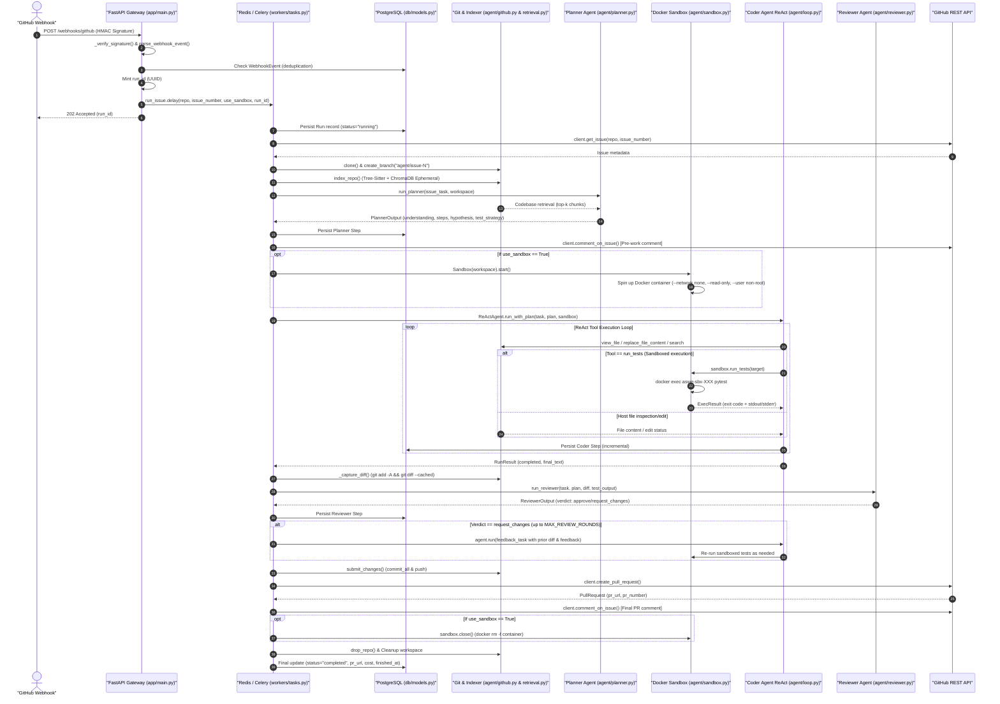

# Autonomous SWE Agent

An AI system that autonomously reads GitHub issues, writes code to fix them, tests the code, and opens Pull Requests. Built over 8 weeks as an advanced AI engineering project.

## Project Overview

The goal is to build a production-grade autonomous AI software engineer that:

1. Watches a GitHub repo for new issues via webhook
2. Spins up an isolated Docker sandbox 
3. Uses an LLM to understand the codebase, plan a fix, write code, run tests, and debug failures
4. Opens a Pull Request with the fix and explanation
5. Does all of this without any human involvement from issue creation to PR opening

This project covers the full stack of an agentic AI system:

- GitHub integration (webhooks, issues, PRs)
- Codebase understanding (tree-sitter parsing, sentence-transformers embedding, ChromaDB vector store)
- ReAct reasoning loop (multi-step Reason → Act → Observe)
- Sandboxed code execution (Docker SDK, network isolation, filesystem constraints, timeouts)
- Backend orchestration (FastAPI, Celery, Redis, PostgreSQL)
- Durable observability (per-agent step traces queryable over HTTP)
- Production deployment (Docker Compose on a cloud VM, TLS, secrets, cost controls)

## System Architecture

The system has six layers, each independently testable and deployable:

1. **GitHub Integration** - webhooks, issue parsing, repo cloning, PR creation
2. **Codebase Understanding** - AST parsing, embedding, vector search, call graph analysis 
3. **Planning & Reasoning** - Multi-agent design (Planner → Coder ReAct loop → Reviewer) with shared token & monetary budget
4. **Sandboxed Execution** - isolated Docker containers, network/filesystem constraints 
5. **Backend & Queue** - FastAPI orchestrator, Celery workers, Redis broker, PostgreSQL store
6. **Observability & DevOps** - metrics, traces, logs, dashboards, Kubernetes, CI/CD

### End-to-End Webhook-to-PR Workflow




## Key Features

- **ReAct reasoning loop:** Full multi-step Reason → Act → Observe → Reason cycle (5-20 steps per issue)
- **Codebase-aware retrieval:** Parses ASTs, builds call graphs, uses hybrid semantic + structural search 
- **Sandboxed execution:** Fresh isolated Docker container per run, no network access, read-only host FS
- **Cost management:** Hard cap on LLM calls, sandbox CPU/time budget, token usage tracking
- **GitHub integration:** Live webhook-to-PR pipeline, no simulated APIs
- **Production observability:** Distributed tracing, Prometheus metrics, Grafana dashboards, Kubernetes

## Status

**Live in production** on an Azure VM since 2026-08-03 — see
[docs/deployment.md](docs/deployment.md).

By component:

- **Codebase understanding** (`agent/retrieval.py`): Done ✅ — tree-sitter chunking, embeddings, in-memory ChromaDB, call graph, token-budgeted context
- **Multi-agent reasoning** (`agent/planner.py`, `agent/loop.py`, `agent/reviewer.py`): Done ✅ — Planner → Coder (ReAct) → Reviewer, one shared token/USD budget across all three, per-role model selection
- **GitHub integration** (`agent/github.py`): Done ✅ — REST client with rate-limiting backoff, HMAC verification, idempotent PR creation, hardened git helpers
- **Docker sandbox** (`agent/sandbox.py`): Built ✅, **off in deployment** — `USE_SANDBOX=false`; a config flip, not a code change (see [docs/deployment.md](docs/deployment.md) §2)
- **Backend & queue** (`app/`, `workers/`, `db/`): Done ✅ — FastAPI gateway, Celery, Redis broker, PostgreSQL with Alembic migrations, append-only run history
- **Security**: Done ✅ — HMAC webhooks, authenticated `POST /runs` (fail-closed), repo allowlist, rate limiting, TLS via Caddy
- **Cloud deployment**: Done ✅ — single Azure VM running the same Compose stack, Let's Encrypt TLS, auto-shutdown for cost control
- **Tests**: 50 integration tests + 9 module self-tests, all offline and API-key-free
- **Observability** (`monitoring/`): Not started ⏳ — the `/runs/{id}/steps` trace endpoint covers most of the need today

### Testing

```bash
python -m pytest tests/ -v    # 50 integration tests, no API key needed
python -m agent.loop          # per-module self-tests (also: planner, reviewer,
                              # github, sandbox, schemas, db.models, workers.tasks, app.main)
```

Every test was confirmed to **fail** against the pre-fix code before being
accepted — a test that passes either way proves nothing.

## Quick Start (Docker Compose & Webhooks)

```bash
# 1. Clone & create environment file
cp .env.example .env
# Set GITHUB_TOKEN, GITHUB_WEBHOOK_SECRET, GEMINI_API_KEY / ANTHROPIC_API_KEY,
# AGENT_API_TOKEN, and AGENT_REPO_ALLOWLIST

# 2. Start the stack (API, Worker, Redis, Postgres, migrations)
docker compose up --build -d
curl localhost:8000/readyz          # {"status":"ready", ... ,"sandbox":"off"}

# 3. Expose the gateway to GitHub
ngrok http 8000

# 4. Register the webhook — one command, no clicking through repo settings
bash scripts/setup_webhook.sh --repo owner/name --url https://<id>.ngrok-free.app
bash scripts/setup_webhook.sh --repo owner/name --ping     # expect 204

# 5. Open an issue — the agent solves it and opens a PR
```

`setup_webhook.sh` is idempotent **by webhook path**, so re-running it after an
ngrok restart updates the existing hook instead of piling up dead ones. It also
supports `--list`, `--ping` and `--delete`.

### Configuration that matters

Each agent can use its own provider and model. Resolution is role-specific vars →
`LLM_*` → a hardcoded default that **can never be empty**:

```bash
PLANNER_MODEL=gemini-3.1-pro-preview     # one call per run — plan quality sets everything downstream
CODER_MODEL=gemini-3.5-flash             # the ReAct loop; dominates token spend, so run it cheap
REVIEWER_MODEL=gemini-3.1-pro-preview    # one call per run — catching what the Coder missed
```

A model id is provider-specific and is never inherited across providers: setting
`PLANNER_PROVIDER=anthropic` while `LLM_PROVIDER=gemini` falls through to the
Anthropic default rather than handing a Gemini model name to the Anthropic API.

```bash
USE_SANDBOX=false            # run tests in the hardened container (needs a Docker daemon)
AGENT_REPO_ALLOWLIST=...     # repos the agent may touch — enforced on webhook AND POST /runs
MAX_USD=5.0                  # per-run spend cap, across all three agents
```

⚠️ These are read **once at process start**. After editing `.env`:
`docker compose up -d --force-recreate api worker`.

### Manual CLI Usage

```bash
# 1. Install dependencies (into your virtual environment)
pip install -r requirements.txt

# 2. Run the agent directly on a task against a local repo
python -m agent.loop "Fix the off-by-one in paginate()" --workspace /path/to/repo --auto-index
```

The model and effort are configurable via env vars (`LLM_PROVIDER`, `LLM_MODEL`,
`LLM_EFFORT`); budgets via CLI flags (`--max-steps`, `--max-usd`).

## Development

The `docs/` folder has deep-dives on each component:

- [docs/deployment.md](docs/deployment.md) — **how it's deployed, what broke getting there, and how to change it**
- [docs/retrieval.md](docs/retrieval.md) — the codebase understanding engine
- [docs/loop.md](docs/loop.md) — the ReAct agent loop and tools
- [docs/github.md](docs/github.md) — GitHub integration: issue intake, PR output, git helpers
- [docs/sandbox.md](docs/sandbox.md) — the hardened Docker execution sandbox
- [docs/llm-provider-abstraction.md](docs/llm-provider-abstraction.md) — ADR: pluggable Anthropic/Gemini providers

[plan2.md](plan2.md) is the single source of truth for architecture, decisions
and open work — including §22, an audit that found 18 defects in the
multi-agent integration and how each was fixed.

Core tech stack:

- Python 3.12
- LLM: pluggable — Anthropic Claude **or** Google Gemini, selectable per agent role
- Docker + Docker Compose
- FastAPI + Celery + Redis + PostgreSQL
- Caddy (TLS), Azure VM
- tree-sitter, sentence-transformers, ChromaDB

The reasoning core is not hard-wired to one vendor. All three agents talk to an
`LLMProvider` interface, and `resolve_role()` picks the provider and model per
role at runtime. See the ADR linked above for the contract and rationale.

Kubernetes/Helm and Prometheus/Grafana were in the original design and are
deliberately **not** built — see `plan2.md` §N5 and §21. A single VM is a
complete deployment for this workload, and the `/runs/{id}/steps` trace endpoint
covers most of what dashboards would.

## About the Author

This project was built by Nadeem, a third-year B.Tech student at IIT Bombay interning at Alimento Agro Foods. Nadeem is preparing for ML/AI engineering roles post-graduation.