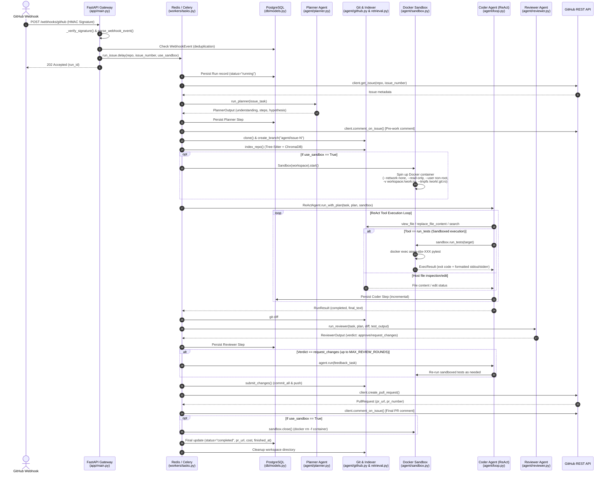

# Auto-SWE Agent: End-to-End Workflow (Webhook to Pull Request)

This document provides a comprehensive, step-by-step description of the execution pipeline inside **auto-swe-agent**, starting from the arrival of a GitHub Webhook event to the final creation of a Pull Request.

---

---

## Detailed Pipeline Breakdown

### Stage 1: GitHub Webhook Ingestion & Signature Verification
* **Primary Module:** `app/main.py`
* **Purpose:** Receive external webhooks, authenticate HTTP requests, deduplicate payloads, and dispatch background jobs.

#### Key Functions & Code References:
1. `webhook_github(request, x_hub_signature_256, x_github_event, x_github_delivery)` (`app/main.py:L89`)
   - Entry point for `POST /webhooks/github`. Reads raw request body and verifies body size against `MAX_WEBHOOK_BODY_BYTES`.
2. `_verify_signature(body, signature, secret)` (`app/main.py:L72`)
   - Computes HMAC-SHA256 hash using `GITHUB_WEBHOOK_SECRET` and performs constant-time string comparison (`hmac.compare_digest`) to prevent timing side-channel attacks.
3. **Database Deduplication Check** (`app/main.py:L123-L136`)
   - Queries `db.models.WebhookEvent` by `delivery_id`. If already processed, returns `202 Accepted` ("duplicate webhook ignored").
4. `parse_webhook_event(payload, event_type)` (`agent/github.py:L483`)
   - Validates event payload: checks `event_type == "issues"`, verifies action is actionable (`opened`, `reopened`, `labeled`), skips pull requests, and excludes Bot authors (`user.type == "Bot"`).
5. `run_issue.delay(issue.repo, issue.number, use_sandbox)` (`workers/tasks.py:L156`)
   - Enqueues task asynchronously to Redis broker and returns `202 Accepted` with `run_id`.

---

### Stage 2: Orchestrator Initialization & Database Run Persistence
* **Primary Module:** `workers/tasks.py`
* **Purpose:** Celery worker picks up the job, initializes state, and records tracking metadata in PostgreSQL.

#### Key Functions & Code References:
1. `run_issue(self, repo, issue_number, use_sandbox)` (`workers/tasks.py:L156`)
   - Core Celery task function. Generates `run_id = uuid.uuid4()`.
2. `_persist_run(session, run_db)` (`workers/tasks.py:L63`)
   - Inserts or updates a row in the `runs` PostgreSQL table (`db.models.Run`) with status `"running"`, provider, and model details.
3. **Idempotency Guard** (`workers/tasks.py:L228-L238`)
   - Checks if an active run already exists for `(repo, issue_number)` with status `"running"`. If so, skips execution to prevent concurrent duplicate agent runs.
4. `client.get_issue(repo, issue_number)` (`agent/github.py:L276`)
   - Fetches issue title, description, and labels using `GitHubClient`. Converts API dict into `Issue` dataclass.

---

### Stage 3: Stage 1 Multi-Agent — Planner Agent Analysis
* **Primary Module:** `agent/planner.py`
* **Purpose:** Perform static reasoning on the issue context to generate a structured implementation plan without editing files.

#### Key Functions & Code References:
1. `run_planner(issue_text, workspace, skip_retrieval)` (`agent/planner.py:L153`)
   - Executes a single structured LLM call (using `PLANNER_PROVIDER` / `PLANNER_MODEL`).
2. `_get_planner_provider()` (`agent/planner.py:L98`)
   - Resolves LLM provider instance (e.g. Anthropic Claude Opus or Google Gemini Pro).
3. `PlannerOutput.from_llm_text(resp.text)` (`agent/schemas.py`)
   - Parses LLM JSON response into a structured schema containing:
     - `understanding`
     - `root_cause_hypothesis`
     - `files_to_touch`
     - `plan_steps`
     - `test_strategy`
     - `risk_notes`
4. `_persist_agent_step(session, run_id, step_n, "planner", plan_dict)` (`workers/tasks.py:L116`)
   - Stores Planner output in the `run_steps` database table for auditability.
5. `client.comment_on_issue(repo, issue_number, comment_body)` (`agent/github.py:L294`)
   - Posts a pre-work comment on GitHub notifying maintainers that the agent is starting work along with its understanding and plan.

---

### Stage 4: Workspace Preparation, Branching & Codebase Indexing
* **Primary Modules:** `agent/github.py`, `agent/retrieval.py`
* **Purpose:** Clone the repository, create a dedicated git branch, and index the codebase for vector search.

#### Key Functions & Code References:
1. `clone(repo, workspace, token)` (`agent/github.py:L595`)
   - Clones repo into local workspace (`/var/agent/workspaces/{run_id}/repo`).
   - Immediately scrubs `GITHUB_TOKEN` credentials from `.git/config` via `remote set-url origin` for security.
2. `configure_identity(workspace)` (`agent/github.py:L584`)
   - Configures git committer name (`auto-swe-agent`) and email locally in workspace.
3. `branch_for_issue(issue_number)` (`agent/github.py:L522`)
   - Generates deterministic branch name: `agent/issue-{number}`.
4. `create_branch(workspace, branch)` (`agent/github.py:L636`)
   - Cuts branch from default branch (`main` / `master`).
5. `retrieval.index_repo(str(workspace))` (`agent/retrieval.py`)
   - Parses code files using Tree-Sitter, builds semantic code chunks, generates vector embeddings (SentenceTransformers), and indexes into ChromaDB.

---

### Stage 5: Docker Sandbox Provisioning (Optional Isolation)
* **Primary Module:** `agent/sandbox.py`
* **Purpose:** Isolate untrusted code execution (running repository tests) inside a hardened Docker container.

#### Key Isolation Guarantees & Code References:
1. `docker_available()` (`agent/sandbox.py:L128`)
   - Checks if Docker daemon is running before attempting sandbox creation.
2. `Sandbox(workspace).start()` (`agent/sandbox.py:L216`)
   - Launches a throwaway container (`aswe-sbx-{uuid}`) with strict hardening flags:
     - `--network none`: Complete network block (prevents credential exfiltration or phone-home).
     - `--read-only`: Root filesystem read-only.
     - `-v {workspace}:/work:rw`: Workspace volume mounted writable.
     - `--tmpfs /work/.git:ro`: Shadows `.git` directory so untrusted code cannot tamper with git hooks or host execution.
     - `--user non-root` (`nobody` / `uid:gid`): Prevents root privilege escalation.
     - `--cap-drop ALL` & `--security-opt no-new-privileges`: Drops all Linux kernel capabilities.
     - Resource caps: `--cpus 1`, `--memory 2g`, `--pids-limit 256` (guard against OOM and fork-bombs).

---

### Stage 6: Stage 2 Multi-Agent — Coder Agent (ReAct Loop)
* **Primary Module:** `agent/loop.py`
* **Purpose:** Iteratively execute code inspection, edits, and test runs to implement the Planner's plan.

#### Key Functions & Code References:
1. `ReActAgent(workspace, auto_index, sandbox)` (`agent/loop.py`)
   - Initializes ReAct loop engine with optional `sandbox` reference.
2. `agent.run_with_plan(task, plan)` (`agent/loop.py`)
   - Injects `PlannerOutput` roadmap into system prompt and starts tool-use loop.
3. **Tool Execution Loop**:
   - Host inspection/edit tools: `view_file`, `replace_file_content`, `semantic_search`, `find_by_name`, `list_directory`.
   - Sandboxed test execution:
     - `sandbox.run_tests(target)` (`agent/sandbox.py:L360`): Dispatches test run into container via `docker exec aswe-sbx-XXX timeout 300s sh -lc "python -m pytest -q <target>"`.
     - `ExecResult.format()`: Formats exit code and stdout/stderr (tail-clipped to 16,000 chars) for the LLM.
4. `_persist_step(session, run_id, step_n, step_data, "coder")` (`workers/tasks.py:L76`)
   - Incrementally saves each ReAct step to `run_steps` in PostgreSQL.

---

### Stage 7: Stage 3 Multi-Agent — Reviewer Agent Audit & Feedback
* **Primary Module:** `agent/reviewer.py`
* **Purpose:** Perform a fresh-context code review of the Coder's diff before submitting a PR.

#### Key Functions & Code References:
1. `subprocess.run(["git", "diff"])` (`workers/tasks.py:L463`)
   - Captures working tree diff of changes made by the Coder.
2. `run_reviewer(issue_text, plan, diff_text, test_output)` (`agent/reviewer.py:L132`)
   - Runs single-turn LLM review with adversarial prompting (checking correctness, security, regressions, completeness).
3. `ReviewerOutput.from_llm_text(resp.text)` (`agent/schemas.py`)
   - Parses review verdict (`approve` vs `request_changes`), concerns, and confidence rating.
4. `_persist_agent_step(session, run_id, step_n, "reviewer", review_dict)` (`workers/tasks.py:L116`)
   - Records review result step in DB.
5. **Feedback Loop (Iterative Re-Run)** (`workers/tasks.py:L504-L534`):
   - If verdict is `request_changes` and `review_round < MAX_REVIEW_ROUNDS`:
     - Calls `build_feedback_task(issue_text, plan, last_review)` to package reviewer feedback into a new prompt.
     - Calls `agent.run(feedback_task)` to re-invoke Coder agent to resolve concerns, re-running tests in sandbox as needed.

---

### Stage 8: Commit, Push & PR Creation
* **Primary Module:** `agent/github.py`
* **Purpose:** Commit modified files, push branch to remote, and open a GitHub Pull Request.

#### Key Functions & Code References:
1. `submit_changes(workspace, repo, branch, base, title, body, client)` (`agent/github.py:L694`)
   - High-level helper encapsulating commit, push, and PR creation.
2. `commit_all(workspace, message)` (`agent/github.py:L658`)
   - Stages all modified files (`git add -A`) and commits (`git commit --no-verify`). Passes `-c core.hooksPath=/dev/null` to enforce host-side git security.
3. `push(workspace, branch, repo, token)` (`agent/github.py:L681`)
   - Pushes branch to GitHub using inline token authentication (`git push --force-with-lease`).
4. `client.create_pull_request(repo, head=branch, base=base, title, body)` (`agent/github.py:L320`)
   - Issues `POST /repos/{repo}/pulls` REST API request. If an existing PR exists (HTTP 422), adopts and updates the existing PR via `find_pull_request`.

---

### Stage 9: Post-Execution Notification, DB Finalization & Resource Teardown
* **Primary Modules:** `workers/tasks.py`, `agent/sandbox.py`
* **Purpose:** Inform maintainers on GitHub, destroy container sandbox, update database metrics, and clean up temporary workspace.

#### Key Functions & Code References:
1. `client.comment_on_issue(repo, issue_number, comment_body)` (`agent/github.py:L294`)
   - Posts final comment on GitHub issue with PR link, total steps used, token count, and USD cost summary.
2. `sandbox.close()` (`agent/sandbox.py:L268`)
   - Issues `docker rm -f aswe-sbx-XXX` to force-remove container and release host resources.
3. `shutil.rmtree(workspace.parent)` (`workers/tasks.py:L648`)
   - Deletes temporary workspace directory from disk (`/var/agent/workspaces/{run_id}`).
4. **Final Database Update** (`workers/tasks.py:L656-L679`)
   - Updates `runs` table row in PostgreSQL:
     - `status = "completed"` (or `"error"`, `"no_changes"`, etc.)
     - `pr_number`, `pr_url`
     - `input_tokens`, `output_tokens`, `cost_usd`
     - `finished_at = datetime.now(timezone.utc)`
